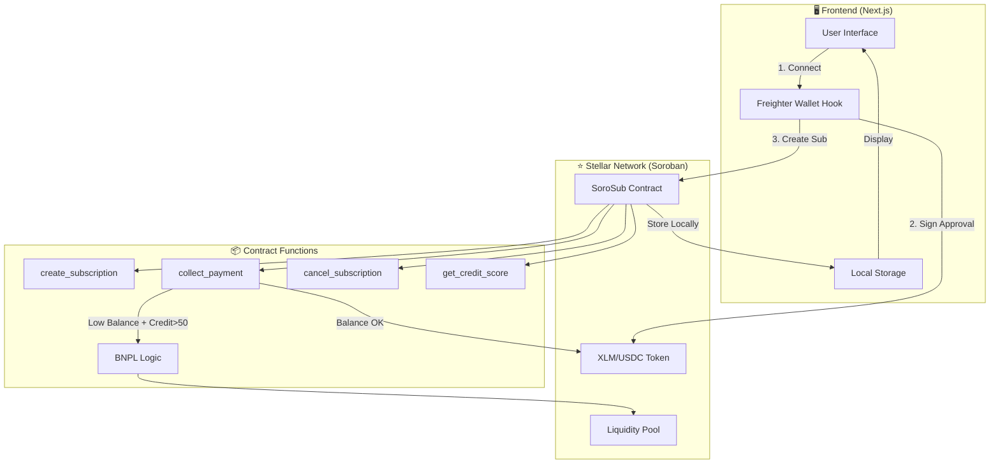
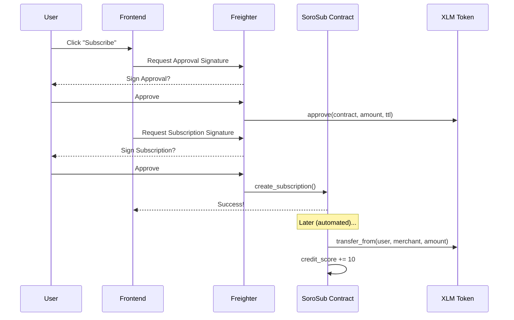
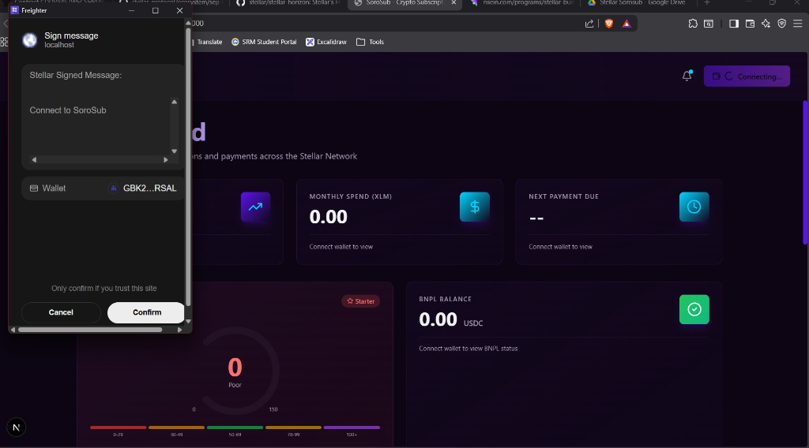
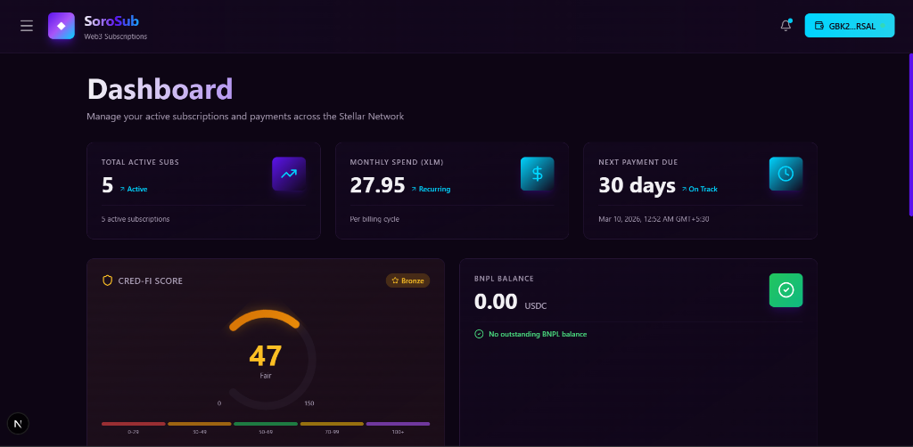
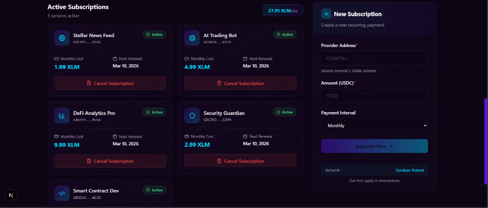
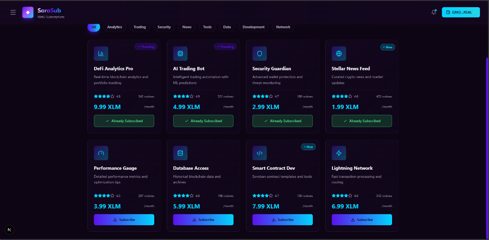
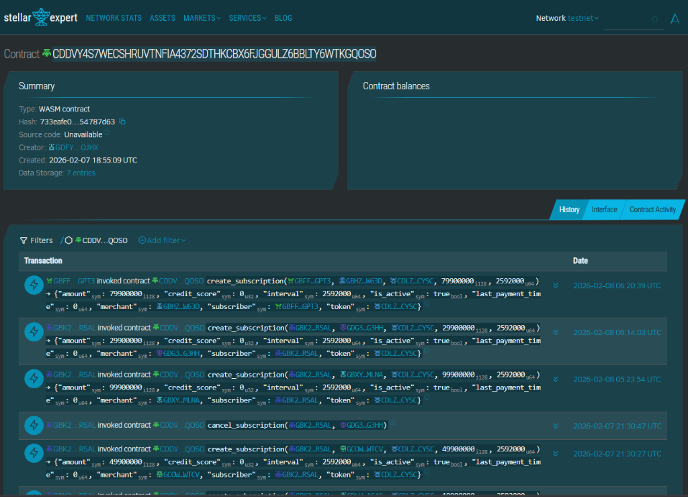

# 🚀 SoroSub - Decentralized Recurring Payments on Stellar

> **The "Stripe of Stellar"** — A decentralized recurring payment protocol with on-chain credit scoring and Buy Now, Pay Later (BNPL) micro-loans, powered by Soroban smart contracts.

[](https://stellar.org)
[](https://soroban.stellar.org)
[](https://stellar.org/community-fund)

---

## 🔗 Deployed Contract (Testnet)

| Property | Value |
|----------|-------|
| **Contract ID** | `CDDVY4S7WECSHRUVTNFIA4372SDTHKCBX6FJGGULZ6BBLTY6WTKGQOSO` |
| **Network** | Stellar Testnet |
| **Explorer** | [View on Stellar Expert](https://stellar.expert/explorer/testnet/contract/CDDVY4S7WECSHRUVTNFIA4372SDTHKCBX6FJGGULZ6BBLTY6WTKGQOSO) |

---

## ❓ Problem Statement

### The Micropayment Revolution

Micropayments—small financial transactions typically ranging from fractions of a cent to $20—are transforming how we pay for digital content, subscriptions, and services. The global shift toward **"pay-as-you-go"** models has created unprecedented demand for low-fee, high-frequency payment rails.

**The Challenge?** Traditional payment systems weren't built for this:

| Traditional System | Problem | Impact |
|-------------------|---------|--------|
| Credit Cards | 2-3% + $0.30 per transaction | A $1 payment loses 33%+ to fees |
| Bank Transfers | 3-5 day settlement | Too slow for instant access |
| PayPal/Stripe | High fees for micro-amounts | Unsustainable for content creators |
| Subscription Platforms | Centralized, take 15-30% cut | Creators earn less, users overpay |

### Why Stellar?

Stellar was **purpose-built** for high-frequency, low-cost value transfers—making it the ideal foundation for micropayments and recurring subscriptions:

| Stellar Advantage | Technical Detail | Benefit |
|-------------------|------------------|---------|
| ⚡ **Near-Zero Fees** | 100 stroops (0.00001 XLM) ≈ $0.000004 | Process millions of $0.01 payments profitably |
| 🚀 **3-5 Second Finality** | Stellar Consensus Protocol (SCP) | Instant confirmation, no waiting |
| 🔄 **Built-in DEX** | Native path payments | Auto-convert currencies during payment |
| 🛡️ **Soroban Smart Contracts** | Rust-based, WASM-compiled | Programmable "set and forget" subscriptions |
| 🌍 **Global Infrastructure** | Used by MoneyGram, Circle, NGOs | Battle-tested for real-world scale |

### Existing Stellar Solutions (Apps)

Several excellent **applications** exist in the Stellar ecosystem for payments:

| App | Type | What It Does |
|-----|------|--------------|
| **Vibrant** | Wallet | USDC-focused, automated savings, simple recurring transfers |
| **Lobstr** | Wallet | Automated recurring buys, subscription-style payments |
| **Scopuly** | Wallet | Advanced trustline management, Pi Network integration |
| **StellarPay** | Merchant Tool | Recurring billing for merchants (WordPress plugin) |
| **Stellar Disbursement Platform** | Enterprise | Bulk payouts for NGOs and businesses |

### The Gap: No Open Protocol

These are all **closed applications**. If you want recurring payments, you must use *their* app, *their* interface, *their* ecosystem. There's no **open protocol** that any wallet, dApp, or merchant can integrate—like how Stripe or Razorpay works in Web2.

**What's missing?**
1. **Universal API** — A protocol any Stellar wallet can plug into
2. **On-chain credit history** — Portable reputation across all dApps  
3. **BNPL for everyone** — Not locked to one platform

### Our Solution: SoroSub Protocol

> **SoroSub is not an app. It's a protocol.**

Just like **Stripe** or **Razorpay** provide APIs that any website can integrate, **SoroSub** provides a smart contract protocol that **any Stellar wallet or dApp** can use.

```
┌──────────────────────────────────────────────────────────────────┐
│                    SOROSUB: A PROTOCOL, NOT AN APP               │
├──────────────────────────────────────────────────────────────────┤
│                                                                  │
│   🔷 STRIPE/RAZORPAY (Web2)         🔷 SOROSUB (Web3)            │
│   ─────────────────────────         ───────────────────          │
│   Any website can integrate         Any Stellar wallet can use   │
│   Centralized API                   Decentralized smart contract │
│   Payment history siloed            Credit score on-chain        │
│   Closed ecosystem                  Open protocol (SEP-41)       │
│                                                                  │
└──────────────────────────────────────────────────────────────────┘
```

### Built on SEP-41 Token Standard

SoroSub leverages the **[SEP-41 Token Interface](https://stellar.org/protocol/sep-41)** standard—Stellar's official specification for fungible tokens on Soroban. This ensures:

- ✅ **Compatibility** with any SEP-41 compliant token (XLM, USDC, EURC, etc.)
- ✅ **Interoperability** with existing Stellar wallets and infrastructure
- ✅ **Security** via standardized `approve()` and `transfer_from()` patterns

```rust
// SoroSub uses standard SEP-41 token interface
token_client.approve(&subscriber, &contract_address, &amount, &expiration_ledger);
token_client.transfer_from(&contract_address, &subscriber, &merchant, &amount);
```

### How SoroSub Works

```
┌──────────────────────────────────────────────────────────────────┐
│                        SOROSUB PROTOCOL FLOW                     │
├──────────────────────────────────────────────────────────────────┤
│                                                                  │
│   1. USER APPROVES ONCE (via any Stellar wallet)                 │
│      token.approve(sorosub_contract, amount, ttl)                │
│                    ↓                                             │
│   2. PROTOCOL PULLS AUTOMATICALLY                                │
│      Every interval: transfer_from(user → merchant)              │
│                    ↓                                             │
│   3. CRED-FI BUILDS CREDIT (on-chain, portable)                  │
│      Each payment: credit_score += 10                            │
│                    ↓                                             │
│   4. BNPL PREVENTS FAILURES                                      │
│      If low balance + credit > 50 → micro-loan from pool         │
│                                                                  │
└──────────────────────────────────────────────────────────────────┘
```

### Comparison: Protocol vs Apps

| Aspect | SoroSub (Protocol) | Vibrant/Lobstr (Apps) | Stripe (Web2) |
|--------|--------------------|-----------------------|---------------|
| **Type** | Open smart contract | Closed application | Centralized API |
| **Integration** | Any wallet/dApp | Only their app | Any website |
| **Credit Score** | On-chain, portable | None | Siloed |
| **Open Source** | ✅ Yes | Varies | ❌ No |
| **Fees** | Network only ($0.000004) | Network + App fees | 2.9% + $0.30 |
| **Custody** | Non-custodial | Varies | Custodial |

### Comparison: SoroSub vs Other Chains

| Feature | SoroSub (Stellar) | Lightning Network | Solana Pay | Traditional |
|---------|-------------------|-------------------|------------|-------------|
| Recurring Payments | ✅ Native | ❌ Manual | ❌ Manual | ✅ Native |
| Transaction Fee | $0.000004 | $0.001 | $0.00025 | $0.30+ |
| On-Chain Credit | ✅ Built-in | ❌ None | ❌ None | ❌ Siloed |
| BNPL Micro-Loans | ✅ Automatic | ❌ None | ❌ None | ⚠️ High APR |
| User Control | ✅ Non-custodial | ✅ Non-custodial | ✅ Non-custodial | ❌ Custodial |
| Settlement Time | 3-5 seconds | Instant | <1 second | 3-5 days |

---

## ✨ Features

| Feature | Description |
|---------|-------------|
| 🔄 **Set-and-Forget Payments** | Approve once, auto-debit monthly using `transfer_from` |
| 📊 **Cred-Fi Credit Scoring** | Build on-chain credit history (+10 points per successful payment) |
| 💳 **BNPL Micro-Loans** | Access credit when balance is low (requires credit score >50) |
| 🔐 **Non-Custodial** | Users maintain full control of their funds |
| ⚡ **Ultra-Low Fees** | 0.00001 XLM per operation (~$0.000004) |
| 🏪 **Service Marketplace** | Browse and subscribe to services in one click |
| 📈 **Dashboard Analytics** | Track subscriptions, spending, and credit score |
| 🌐 **Payment Streaming Ready** | Architecture supports per-second micropayments |

### 📊 Cred-Fi Score Calculation

The Cred-Fi score is calculated in **real-time** using data from the **Stellar Horizon API**:

| Component | Points | How It's Calculated |
|-----------|--------|---------------------|
| **Base Score** | 10 | Awarded for having a connected wallet |
| **Account Activity** | 0-15 | Based on account sequence number (higher = more active) |
| **Payment Count** | 0-20 | 1 point per real payment (capped at 20) |
| **Transaction Count** | 0-15 | Based on total transactions (5→5pts, 20→10pts, 50→15pts) |
| **XLM Balance** | 0-10 | Balance tiers: 1→2pts, 10→4pts, 100→7pts, 1000→10pts |
| **SoroSub Payments** | +10 each | Each successful subscription payment adds 10 points |

**Formula:** `Cred-Fi Score = Base(10) + Activity(0-15) + Payments(0-20) + Transactions(0-15) + Balance(0-10) + SoroSub(+10/payment)`

> **New wallets start at 10 points.** Score increases automatically as you make transactions, hold XLM, and pay subscriptions!

---

## 🏗️ Architecture Overview



### Payment Flow



### Data Flow Diagram

```mermaid
erDiagram
    USER ||--o{ SUBSCRIPTION : creates
    USER ||--o| DEBT : may_have
    SUBSCRIPTION ||--|| MERCHANT : pays_to
    SUBSCRIPTION }|--|| TOKEN : uses
    LIQUIDITY_POOL ||--o{ DEBT : funds

    USER {
        address public_key
        uint credit_score
    }
    
    SUBSCRIPTION {
        address subscriber
        address merchant
        address token
        i128 amount
        u64 interval
        u64 last_payment
        bool is_active
    }
    
    DEBT {
        i128 amount
        address token
    }
```



---

## 📁 Project Structure

```
sorosub/
├── backend/                    # Soroban Smart Contracts
│   ├── Cargo.toml
│   └── contracts/
│       └── sorosub/
│           └── src/
│               ├── lib.rs      # Main contract logic
│               └── test.rs     # Comprehensive tests (13 passing)
│
└── frontend/                   # Next.js Web Application
    ├── app/                    # App router pages
    │   └── dashboard/          # User dashboard
    ├── components/             # React components
    │   ├── Marketplace.tsx     # Service marketplace
    │   ├── ActiveSubscriptions.tsx
    │   ├── CreditScoreCard.tsx
    │   └── ...
    ├── hooks/
    │   └── useStellarWallet.ts # Freighter integration
    └── lib/
        ├── stellar.ts          # Network config
        ├── sorosub-client.ts   # Contract interactions
        └── subscription-storage.ts
```

---

## 🔧 Smart Contract API

### Core Functions

| Function | Description | Auth |
|----------|-------------|------|
| `initialize(admin, liquidity_pool)` | One-time setup | Admin |
| `create_subscription(subscriber, merchant, token, amount, interval)` | Create subscription | Subscriber |
| `collect_payment(subscriber, merchant)` | Process payment (with BNPL fallback) | Anyone |
| `cancel_subscription(subscriber, merchant)` | Cancel subscription | Subscriber |
| `get_credit_score(subscriber, merchant)` | Get on-chain credit score | None |
| `repay_debt(user, amount)` | Repay BNPL loan | User |

### BNPL Logic

```rust
// Pseudocode for payment collection
if user_balance >= payment_amount {
    // Normal payment path
    token.transfer_from(user, merchant, amount);
    credit_score += 10;
} else if credit_score > 50 {
    // BNPL: Liquidity pool covers the payment
    token.transfer(pool, merchant, amount);
    user_debt += amount;
    emit_event("bnpl_triggered");
} else {
    // Payment fails - insufficient balance AND low credit
    panic!("Insufficient balance and credit");
}
```

---

## 🚀 Quick Start

### Prerequisites

- [Rust](https://rustup.rs/) (1.70+)
- [Stellar CLI](https://developers.stellar.org/docs/tools/developer-tools/cli/install-cli)
- [Node.js](https://nodejs.org/) (18+)
- [Freighter Wallet](https://freighter.app/)

### Run Locally

```bash
# Clone the repository
git clone https://github.com/dhanush-adi/Sorosub.git
cd Sorosub

# Backend: Build and test contract
cd backend
stellar contract build
cargo test --package sorosub

# Frontend: Install and run
cd ../frontend
npm install
npm run dev
```

Open [http://localhost:3000](http://localhost:3000) in your browser.

---

## 📸 Screenshots

### Wallet Connection

*Freighter wallet integration with message signing for secure authentication*

### Dashboard

*Real-time dashboard showing active subscriptions, monthly spend, credit score, and BNPL status*

### Active Subscriptions

*Manage your active subscriptions with cancel options and renewal dates*

### Service Marketplace

*Browse and subscribe to services with one-click subscription*

### On-Chain Contract Activity

*Stellar Expert showing real `create_subscription` and `cancel_subscription` transactions on testnet*

---

## 🔐 Security Model

### Token Allowance Pattern (SEP-0041)

SoroSub uses Stellar's **token allowance system** for secure recurring payments:

1. **User approves once**: `token.approve(sorosub_contract, amount, expiration_ledger)`
2. **Contract pulls on schedule**: `token.transfer_from(user, merchant, amount)`
3. **TTL protection**: Approvals expire after ~6 days (100,000 ledgers)

### Security Guarantees

| Check | Implementation |
|-------|----------------|
| ✅ Interval Enforcement | Payments only after `last_payment + interval` |
| ✅ Balance Verification | Pre-check before `transfer_from` |
| ✅ Credit Gating | BNPL requires `credit_score > 50` |
| ✅ Auth Requirements | Critical functions require `require_auth()` |
| ✅ Admin Controls | Only admin can initialize contract |

---

## 🗺️ Future Scope

### Phase 1: Enhanced Features (Q2 2026)
- [ ] Multi-token support (USDC, EURC, yUSD)
- [ ] Push notifications for payment events
- [ ] Merchant analytics dashboard

### Phase 2: Ecosystem Integration (Q3 2026)
- [ ] Integration with Stellar Disbursement Platform
- [ ] Credit score NFTs (portable reputation)
- [ ] Merchant SDK for easy onboarding

### Phase 3: Advanced DeFi (Q4 2026)
- [ ] Payment streaming (per-second micropayments)
- [ ] P2P lending based on credit scores
- [ ] Cross-asset subscriptions via path payments

### Long-Term Vision
- [ ] Mainnet launch with real merchants
- [ ] DAO governance for protocol upgrades
- [ ] Interoperability with other chains via bridges

---

## 🧪 Testing

All **13 tests** passing:

```
running 13 tests
test test::test_initialization ... ok
test test::test_create_subscription ... ok
test test::test_process_payment ... ok
test test::test_process_payment_too_early - should panic ... ok
test test::test_process_payment_after_interval ... ok
test test::test_cancel_subscription ... ok
test test::test_payment_after_cancel - should panic ... ok
test test::test_can_process_payment ... ok
test test::test_credit_score_increment ... ok
test test::test_bnpl_trigger ... ok
test test::test_bnpl_fails_low_credit - should panic ... ok
test test::test_repay_debt ... ok
test test::test_double_initialization - should panic ... ok

test result: ok. 13 passed; 0 failed
```

---

## 📚 References

- [Stellar Developer Docs](https://developers.stellar.org/)
- [Soroban Smart Contracts](https://soroban.stellar.org/)
- [SEP-0041: Token Interface](https://stellar.org/protocol/sep-41)
- [Payment Streaming on Soroban](https://github.com/AhaLabs/streaming-payment-dapp-soroban)

---

## 👥 Team

Built for the **Stellar Community Fund Build-A-Thon**

---

## 📄 License

MIT License - see [LICENSE](LICENSE) for details.

---

<p align="center">
  Built with ❤️ for the <strong>Stellar Community Fund Build-A-Thon</strong>
</p>
