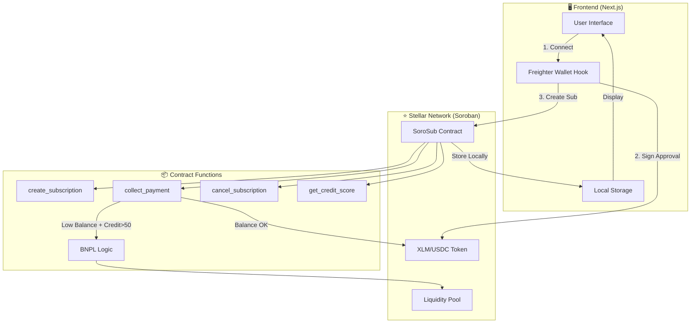
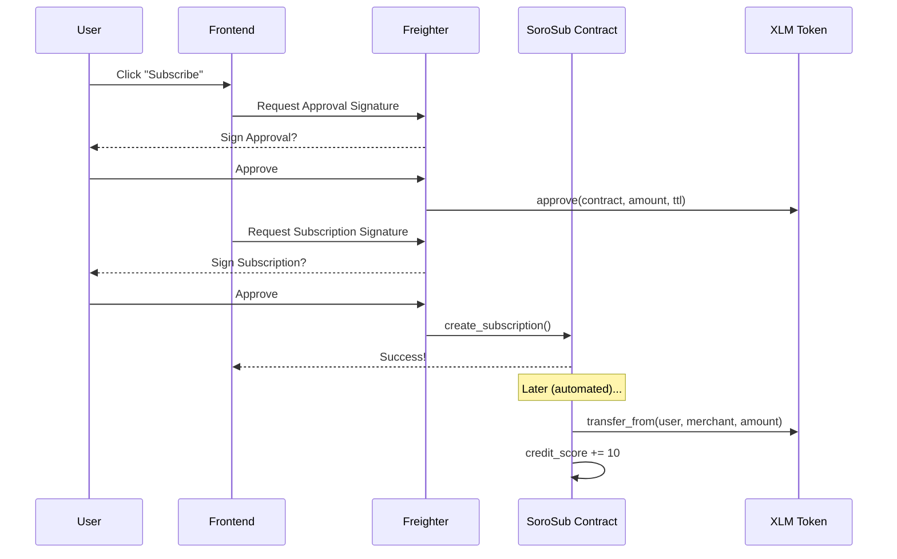

# 🚀 SoroSub - Decentralized Recurring Payments on Stellar

> **The "Stripe of Stellar"** — A decentralized recurring payment protocol with on-chain credit scoring and Buy Now, Pay Later (BNPL) micro-loans.

[](https://stellar.org)
[](https://soroban.stellar.org)
[](https://stellar.org/community-fund)

---

## 🔗 Deployed Contract (Testnet)

| Property | Value |
|----------|-------|
| **Contract ID** | `CDDVY4S7WECSHRUVTNFIA4372SDTHKCBX6FJGGULZ6BBLTY6WTKGQOSO` |
| **Network** | Stellar Testnet |
| **Explorer** | [View on Stellar Expert](https://stellar.expert/explorer/testnet/contract/CDDVY4S7WECSHRUVTNFIA4372SDTHKCBX6FJGGULZ6BBLTY6WTKGQOSO) |

---

## ❓ Problem Statement

### The Challenge

Traditional subscription services face critical limitations:

1. **Centralized Control**: Users must trust third-party payment processors with their financial data
2. **No Credit Building**: Subscription payment history doesn't contribute to financial reputation
3. **Payment Failures**: When card balances are low, subscriptions fail causing service interruptions
4. **High Fees**: Traditional systems charge 2-3% per transaction
5. **No Interoperability**: Payment histories are siloed within individual platforms

### Our Solution

**SoroSub** solves these problems by leveraging Stellar's Soroban smart contracts:

| Problem | SoroSub Solution |
|---------|------------------|
| Centralized control | **Non-custodial**: Users approve once, maintain full control |
| No credit building | **Cred-Fi**: On-chain credit scoring (+10 per successful payment) |
| Payment failures | **BNPL**: Automatic micro-loans from liquidity pool (credit score >50) |
| High fees | **Sub-cent fees**: Stellar's low transaction costs |
| No interoperability | **On-chain history**: Portable credit scores across dApps |

---

## ✨ Features

| Feature | Description |
|---------|-------------|
| 🔄 **Set-and-Forget Payments** | Approve once, auto-debit monthly using `transfer_from` |
| 📊 **On-Chain Credit Scoring** | Build credit history (+10 points per successful payment) |
| 💳 **BNPL Micro-Loans** | Access credit when balance is low (requires credit score >50) |
| 🔐 **Non-Custodial** | Users maintain full control of their funds |
| ⚡ **Ultra-Low Fees** | 0.001 XLM per transaction |
| 🏪 **Service Marketplace** | Browse and subscribe to services in one click |
| 📈 **Dashboard Analytics** | Track subscriptions, spending, and credit score |

---

## 🏗️ Architecture Overview



### Payment Flow



---

## 📁 Project Structure

```
sorosub/
├── backend/                    # Soroban Smart Contracts
│   ├── Cargo.toml
│   └── contracts/
│       └── sorosub/
│           └── src/
│               ├── lib.rs      # Main contract logic (553 lines)
│               └── test.rs     # Comprehensive tests (13 passing)
│
└── frontend/                   # Next.js Web Application
    ├── app/                    # App router pages
    │   └── dashboard/          # User dashboard
    ├── components/             # React components
    │   ├── Marketplace.tsx     # Service marketplace
    │   ├── ActiveSubscriptions.tsx
    │   ├── CreditScoreCard.tsx
    │   └── ...
    ├── hooks/
    │   └── useStellarWallet.ts # Freighter integration
    └── lib/
        ├── stellar.ts          # Network config
        ├── sorosub-client.ts   # Contract interactions
        └── subscription-storage.ts
```

---

## 🔧 Smart Contract API

### Core Functions

| Function | Description | Auth |
|----------|-------------|------|
| `initialize(admin, liquidity_pool)` | One-time setup | Admin |
| `create_subscription(subscriber, merchant, token, amount, interval)` | Create subscription | Subscriber |
| `collect_payment(subscriber, merchant)` | Process payment (with BNPL fallback) | Anyone |
| `cancel_subscription(subscriber, merchant)` | Cancel subscription | Subscriber |
| `get_credit_score(subscriber, merchant)` | Get on-chain credit score | None |
| `repay_debt(user, amount)` | Repay BNPL loan | User |

### BNPL Logic

```
IF user_balance >= payment_amount:
    → Normal payment, credit_score += 10
    
ELSE IF credit_score > 50:
    → BNPL: Pay from liquidity pool
    → Record debt against user
    → Emit "bnpl" event
    
ELSE:
    → Payment fails (insufficient balance + low credit)
```

---

## 🚀 Quick Start

### Prerequisites

- [Rust](https://rustup.rs/) (1.70+)
- [Stellar CLI](https://developers.stellar.org/docs/tools/developer-tools/cli/install-cli)
- [Node.js](https://nodejs.org/) (18+)
- [Freighter Wallet](https://freighter.app/)

### Run Locally

```bash
# Clone the repository
git clone https://github.com/dhanush-adi/Sorosub.git
cd Sorosub

# Backend: Build and test contract
cd backend
stellar contract build
cargo test --package sorosub

# Frontend: Install and run
cd ../frontend
npm install
npm run dev
```

Open [http://localhost:3000](http://localhost:3000) in your browser.

---

## 📸 Screenshots

> *Screenshots will be added here*

<!-- 


-->

---

## 🔐 Security Model

### Auth Abstraction Pattern

SoroSub uses Stellar's token allowance system for secure recurring payments:

1. **User approves once**: `token.approve(sorosub_contract, amount, expiration)`
2. **Contract pulls on schedule**: `token.transfer_from(user, merchant, amount)`
3. **Expiration protection**: Approvals use ledger-based TTL (~6 days)

### Security Checks

- ✅ **Interval enforcement**: Payments only process after interval passes
- ✅ **Balance verification**: Checks user balance before transfer
- ✅ **Credit gating**: BNPL requires credit score >50
- ✅ **Auth requirements**: Critical functions require signatures

---

## 🗺️ Future Scope

### Short-Term (v1.1)
- [ ] Multi-token support (USDC, EURC, other Stellar assets)
- [ ] Email/webhook notifications for payments
- [ ] Subscription analytics dashboard for merchants

### Medium-Term (v2.0)
- [ ] Cross-chain subscriptions via bridges
- [ ] Credit score NFTs (portable reputation)
- [ ] Merchant SDK for easy integration

### Long-Term Vision
- [ ] Decentralized credit bureaus
- [ ] P2P lending based on credit scores
- [ ] Mainnet launch with real merchants

---

## 🧪 Testing

All 13 tests passing:

```
running 13 tests
test test::test_initialization ... ok
test test::test_create_subscription ... ok
test test::test_process_payment ... ok
test test::test_process_payment_too_early - should panic ... ok
test test::test_process_payment_after_interval ... ok
test test::test_cancel_subscription ... ok
test test::test_payment_after_cancel - should panic ... ok
test test::test_can_process_payment ... ok
test test::test_credit_score_increment ... ok
test test::test_bnpl_trigger ... ok
test test::test_bnpl_fails_low_credit - should panic ... ok
test test::test_repay_debt ... ok
test test::test_double_initialization - should panic ... ok

test result: ok. 13 passed; 0 failed
```

---

## 👥 Team

Built for the **Stellar Community Fund Build-A-Thon**

---

## 📄 License

MIT License - see [LICENSE](LICENSE) for details.

---

<p align="center">
  Built with ❤️ for the <strong>Stellar Community Fund Build-A-Thon</strong>
</p>
